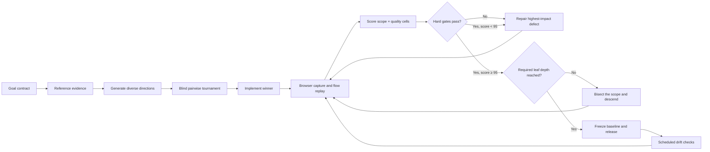

# TOP1 DESIGN

## The Aesthetic Singularity Engine

**It does not ask an AI to have taste. It forces the AI to earn it.**

TOP1 DESIGN is an open Agent Skill and design harness for building, critiquing, and recursively improving web and app interfaces. It replaces vague prompts such as “make it premium” with a goal contract, evidence-backed reference library, two recursive quality trees, pairwise design tournaments, hard release gates, and a persistent improvement ledger.

The name is intentionally arrogant. The process is not. Every conclusion needs evidence.

> `95` is an internal promotion threshold, not a scientific claim of objective beauty. A surface that reaches 95 at one level must descend to the next required level.

## Why this exists

Most design Skills are strong at one of four jobs:

- generating a visual direction;
- retrieving design rules or palettes;
- auditing accessibility and implementation details;
- polishing a finished surface.

TOP1 DESIGN connects those jobs into one closed loop:



## The two-tree model

One score tree is not enough. A page can have excellent typography and a broken onboarding flow; an average hides that failure.

TOP1 DESIGN evaluates the Cartesian product of two trees:

1. **Scope tree** — experience → surface → region → component → element → state or motion frame.
2. **Quality tree** — value → comprehension / credibility; experience → perception / operation.

The scope tree is recursively bisected into at most two coherent children. The weakest required leaf controls release. A parent cannot compensate for a failed child.

## What ships in this repository

- `skills/top1-design/SKILL.md` — the installable Agent Skill.
- `skills/top1-design/scripts/init_harness.py` — installs the persistent harness into a project.
- `skills/top1-design/scripts/capture_reference.py` — captures real pages through Kimi WebBridge and records provenance.
- `skills/top1-design/scripts/rank_candidates.py` — ranks blinded pairwise comparisons.
- `skills/top1-design/scripts/score_design.py` — computes node scores, confidence caps, hard gates, and promotion status.
- `skills/top1-design/references/` — scoring rubrics, browser protocol, ecosystem research, orchestration rules, and the seed taste library.
- `skills/top1-design/assets/harness-template/` — project-local goal, taste, quality-tree, and evaluation templates.
- `examples/` — realistic evaluation and pairwise tournament fixtures.
- `tests/` — deterministic tests for the scoring and ranking engines.

## Quick start

Install the Skill with any Agent Skills-compatible installer:

```bash
npx skills add cubxxw/top1-design --skill top1-design
```

Or copy `skills/top1-design` into your agent's Skills directory.

Then ask:

```text
Use $top1-design to redesign this recruiting product landing page.
Build the reference library first, run a blinded direction tournament,
then recurse from the whole page to sections, components, states, and motion.
Do not release until all required leaves pass.
```

Initialize the durable harness in an existing project:

```bash
python skills/top1-design/scripts/init_harness.py /path/to/project
```

Score an evaluation:

```bash
python skills/top1-design/scripts/score_design.py examples/talent-signal-home/evaluation.json
```

Rank a pairwise tournament:

```bash
python skills/top1-design/scripts/rank_candidates.py examples/talent-signal-home/pairs.jsonl
```

Capture a reference with the user's real browser and Kimi WebBridge:

```bash
python skills/top1-design/scripts/capture_reference.py \
  https://www.granola.ai/ granola-home \
  --output .top1-design/references
```

The capture command never closes browser tabs. Raw screenshots are local evidence and should not be published unless their rights are clear.

## Release rule

A design is releasable only when:

- every required terminal scope node reaches the threshold;
- every hard gate passes;
- confidence is high enough to support the score;
- the required scope depth has been inspected;
- desktop, mobile, keyboard, reduced-motion, loading, empty, error, and success states have evidence where relevant;
- the design still serves the product goal and does not merely resemble a fashionable reference;
- a stable visual baseline and decision ledger are stored.

There is no “one giant prompt” escape hatch.

## Research lineage

TOP1 DESIGN synthesizes and extends ideas from:

- [Anthropic frontend-design](https://github.com/anthropics/skills/tree/main/skills/frontend-design)
- [OpenAI frontend Skill](https://github.com/openai/skills/tree/main/skills/.curated/frontend-skill)
- [Impeccable](https://github.com/pbakaus/impeccable)
- [UI UX Pro Max](https://github.com/nextlevelbuilder/ui-ux-pro-max-skill)
- [Vercel Web Interface Guidelines](https://vercel.com/design/guidelines)
- [Open Design](https://github.com/nexu-io/open-design)
- [Apple Human Interface Guidelines](https://developer.apple.com/design/human-interface-guidelines)
- [UI-Bench](https://arxiv.org/abs/2508.20410)
- [Design2Code](https://github.com/NoviScl/Design2Code)
- [Playwright visual comparisons](https://playwright.dev/docs/test-snapshots)
- [WCAG 2.2](https://www.w3.org/TR/WCAG22/)

See `skills/top1-design/references/skill-landscape.md` for the dated comparison and design decisions.

## Local evidence and copyright

The public repository stores URLs, observations, evaluation metadata, and reproducible capture instructions. It ignores `.research/captures/` and project-local `.top1-design/references/**/capture-*` image files by default. A screenshot is evidence, not a reusable visual asset.

Copy principles and relationships. Do not copy trademarks, proprietary illustrations, text, or distinctive compositions.

## License

MIT. See [LICENSE](LICENSE).
