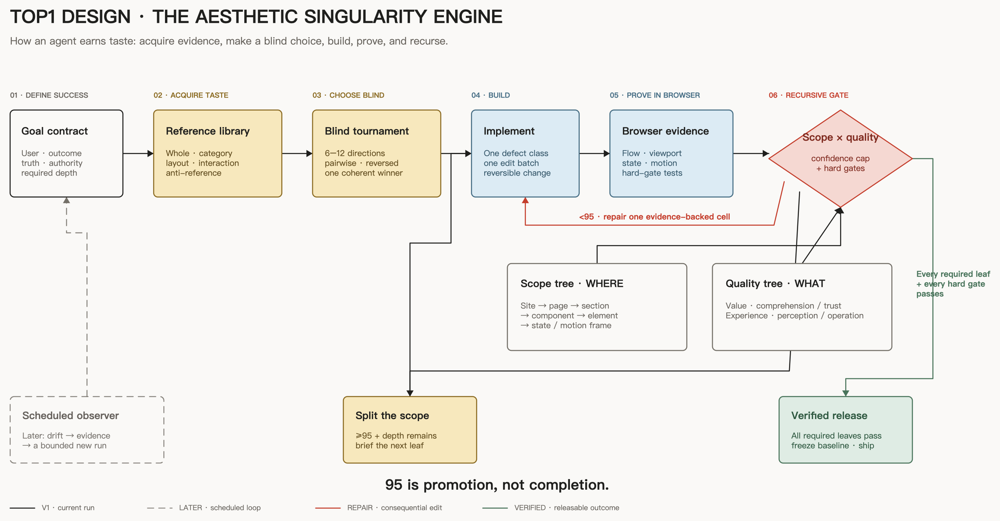

# TOP1 DESIGN

## The Aesthetic Singularity Engine

**It does not ask an AI to have taste. It forces the AI to earn it.**

TOP1 DESIGN is an open Agent Skill and design harness for building, critiquing, and recursively improving web and app interfaces. It replaces vague prompts such as “make it premium” with a goal contract, evidence-backed reference library, two recursive quality trees, pairwise design tournaments, hard release gates, and a persistent improvement ledger.

The name is intentionally arrogant. The process is not. Every conclusion needs evidence.

> `95` is an internal promotion threshold, not a scientific claim of objective beauty. A surface that reaches 95 at one level must descend to the next required level.

The first commercial wedge is deliberately narrower: **an automatic design
final-review and redo Agent for AI website builders**. It understands a generated
site, acquires relevant references, creates isolated alternatives, reviews
desktop and mobile behavior, edits a supported repository, compares before and
after, and repairs until the declared Release Bar passes.

## Why this exists

Most design Skills are strong at one of four jobs:

- generating a visual direction;
- retrieving design rules or palettes;
- auditing accessibility and implementation details;
- polishing a finished surface.

TOP1 DESIGN connects those jobs into one closed loop:

[](docs/top1-design-architecture.svg)

Read the solid route from left to right: goal → acquired taste → blind choice → implementation → browser evidence → recursive gate. A score below 95 repairs one evidence-backed cell; a score at or above 95 descends to the next required scope; only passing every required leaf freezes a release baseline. The dashed route is the later scheduled drift observer.

[Open the editable Excalidraw source](docs/top1-design-architecture.excalidraw) or import it directly into [Excalidraw](https://excalidraw.com/).

## The two-tree model

One score tree is not enough. A page can have excellent typography and a broken onboarding flow; an average hides that failure.

TOP1 DESIGN evaluates the Cartesian product of two trees:

1. **Scope tree** — experience → surface → region → component → element → state or motion frame.
2. **Quality tree** — value → comprehension / credibility; experience → perception / operation.

The scope tree is recursively bisected into at most two coherent children. The weakest required leaf controls release. A parent cannot compensate for a failed child.

## What ships in this repository

- `skills/top1-design/SKILL.md` — the installable Agent Skill.
- `skills/top1-design/scripts/init_harness.py` — installs the persistent harness into a project.
- `skills/top1-design/scripts/capture_reference.py` — captures real pages through Kimi WebBridge and records provenance.
- `skills/top1-design/scripts/diagnose_project.py` — selects Greenfield, Rescue, or Governed mode and a safe mutation level from declared and repository evidence.
- `skills/top1-design/scripts/rank_candidates.py` — ranks blinded pairwise comparisons.
- `skills/top1-design/scripts/score_design.py` — computes node scores, confidence caps, hard gates, and promotion status.
- `skills/top1-design/scripts/assess_release.py` — combines recursive scores with visual, interaction, responsive, accessibility, functional, and change-control evidence.
- `skills/top1-design/scripts/assess_product_metrics.py` — verifies the four cohort-level commercial success targets without turning them into an aesthetic claim.
- `skills/top1-design/references/` — scoring rubrics, browser protocol, ecosystem research, orchestration rules, and the seed taste library.
- `skills/top1-design/assets/harness-template/` — project-local goal, taste, quality-tree, and evaluation templates.
- [`cubxxw/taste-view`](https://github.com/cubxxw/taste-view) — the independent
  dogfood product site that turns the method into a visible compare → compile →
  release experience.
- `examples/` — realistic evaluation, release, cohort, and tournament fixtures.
- `tests/` — deterministic tests for the scoring and ranking engines.

## Use it by talking to your agent

Yes: giving the goal directly to an AI agent is the recommended interface. The Skill owns the procedure; your prompt should add the product-specific truth that the Skill cannot know.

If TOP1 DESIGN may not be installed, give your agent this:

> Check whether the `top1-design` Skill is available. If it is missing, install it from `https://github.com/cubxxw/top1-design` using your available Skill installer, inspect what will be installed, and confirm that the Skill loads. Then use `$top1-design` to redesign `<target page or repository>` for `<target user>` so they can `<valuable outcome>`. You may inspect the current product, open reference sites in a real browser, create reversible branches, edit the scoped frontend, and run tests. Preserve truthful product behavior and existing user data. Run the complete reference, blind-comparison, browser-evidence, and recursive release protocol. A passing whole page is not completion: continue through the required sections, components, states, responsive layouts, and motion. Do not release until every required leaf and hard gate passes. Return the evidence, winning direction, remaining risks, and release status.

If it is already installed, the shortest reliable prompt is:

> Use `$top1-design` to redesign `<target>` for `<user>` so they can `<outcome>`. Build the reference library first, run a blinded direction tournament, then recurse from the whole experience to surfaces, sections, components, elements, states, responsive layouts, and motion. You may change `<authorized scope>` but must preserve `<invariants>`. Do not release until every required leaf and hard gate passes. Return the evidence, winning direction, remaining risks, and release status.

Mentioning `$top1-design` explicitly is more deterministic than relying on implicit Skill discovery. Describing the target user, outcome, authority, and invariants is more useful than repeating every internal scoring step.

## What it can safely operate on

Review and mutation are different products:

| Target | Browser review | Automatic code change |
|---|---|---|
| any stable, accessible website | supported | only with a repository adapter |
| React or Next.js + Tailwind + stable build | supported | first-release supported path |
| React or Next.js with missing build/style evidence | supported when runnable | conditional, small patch only |
| Vue, Nuxt, Svelte, static HTML, Webflow, unknown stack | supported when runnable | review-only until an adapter exists |

The Agent diagnoses one of three postures:

- **Greenfield:** broad isolated search and a new coherent direction.
- **Rescue:** preserve validated product structure; repair tokens and shared
  components before page-by-page polish.
- **Governed:** audit first and produce small reversible patches that respect the
  existing design system and release process.

Run the diagnosis directly:

```bash
python skills/top1-design/scripts/diagnose_project.py /path/to/project \
  --target-url http://localhost:3000/
```

Repository heuristics choose a safe posture; they do not prove company maturity
or grant authority.

<details>
<summary>Manual installation and CLI fallback</summary>

Use these only when your agent cannot install or operate the Skill for you.

```bash
npx skills add cubxxw/top1-design --skill top1-design
```

Or copy `skills/top1-design` into your agent's Skills directory.

Initialize the durable harness:

```bash
python skills/top1-design/scripts/init_harness.py /path/to/project
```

Score an evaluation:

```bash
python skills/top1-design/scripts/score_design.py examples/talent-signal-home/evaluation.json
```

Assess the full Release Bar:

```bash
python skills/top1-design/scripts/assess_release.py \
  examples/release-ready/release-manifest.json
```

Rank a pairwise tournament:

```bash
python skills/top1-design/scripts/rank_candidates.py examples/talent-signal-home/pairs.jsonl
```

Assess a matched product pilot:

```bash
python skills/top1-design/scripts/assess_product_metrics.py \
  examples/product-validation/cohort.json
```

Capture a browser reference:

```bash
python skills/top1-design/scripts/capture_reference.py \
  https://www.granola.ai/ granola-home \
  --output .top1-design/references
```

</details>

The browser capture workflow never closes the user's tabs. Raw screenshots are local evidence and should not be published unless their rights are clear.

## Release rule

A design is releasable only when:

- every required terminal scope node reaches the threshold;
- every hard gate passes;
- confidence is high enough to support the score;
- the required scope depth has been inspected;
- declared desktop, mobile, keyboard, accessibility, responsive, functional,
  visual, interaction, reduced-motion, loading, empty, error, and success
  coverage has current evidence where relevant;
- no unresolved blocker or severe defect remains;
- tests, authority, blast radius, and rollback readiness pass;
- the design still serves the product goal and does not merely resemble a fashionable reference;
- a stable visual baseline and decision ledger are stored.

`assess_release.py` turns this definition into a deterministic, inspectable
decision. The script verifies the record; browser and accessibility tools must
produce the underlying evidence truthfully.

There is no “one giant prompt” escape hatch.

## Commercial success is a cohort result

The initial product hypothesis succeeds only when a predeclared matched cohort
meets all four targets:

- at least 95% of eligible audited units have no unresolved blocker/severe visual
  or interaction defect;
- at least 90% of eligible projects reach their declared Release Bar;
- at least 70% of all valid blinded comparisons, including ties in the
  denominator, prefer the Taste Engine version;
- matched human edit time falls by at least 50%.

These are engineering quality, releasability, preference, and labor-saving
claims. They are intentionally not “95% of sites become top-tier design.”

## Research lineage

TOP1 DESIGN synthesizes and extends ideas from:

- [Anthropic frontend-design](https://github.com/anthropics/skills/tree/main/skills/frontend-design)
- [OpenAI frontend Skill](https://github.com/openai/skills/tree/main/skills/.curated/frontend-skill)
- [Impeccable](https://github.com/pbakaus/impeccable)
- [UI UX Pro Max](https://github.com/nextlevelbuilder/ui-ux-pro-max-skill)
- [Vercel Web Interface Guidelines](https://vercel.com/design/guidelines)
- [Open Design](https://github.com/nexu-io/open-design)
- [Apple Human Interface Guidelines](https://developer.apple.com/design/human-interface-guidelines)
- [UI-Bench](https://arxiv.org/abs/2508.20410)
- [Design2Code](https://github.com/NoviScl/Design2Code)
- [Playwright visual comparisons](https://playwright.dev/docs/test-snapshots)
- [WCAG 2.2](https://www.w3.org/TR/WCAG22/)

See `skills/top1-design/references/skill-landscape.md` for the dated comparison and design decisions.

## Local evidence and copyright

The public repository stores URLs, observations, evaluation metadata, and reproducible capture instructions. It ignores `.research/captures/` and project-local `.top1-design/references/**/capture-*` image files by default. A screenshot is evidence, not a reusable visual asset.

Copy principles and relationships. Do not copy trademarks, proprietary illustrations, text, or distinctive compositions.

## License

MIT. See [LICENSE](LICENSE).
